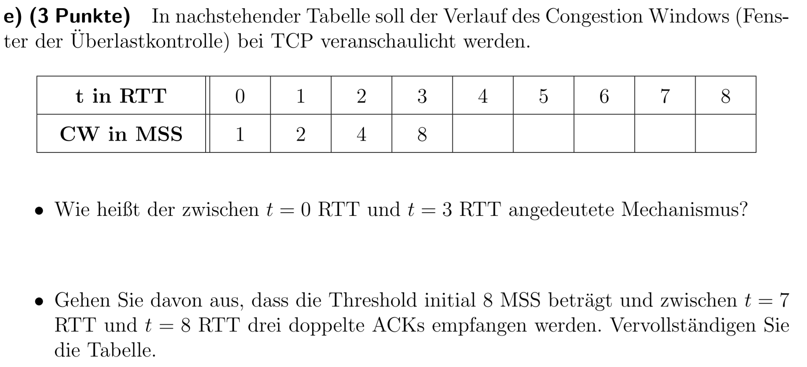
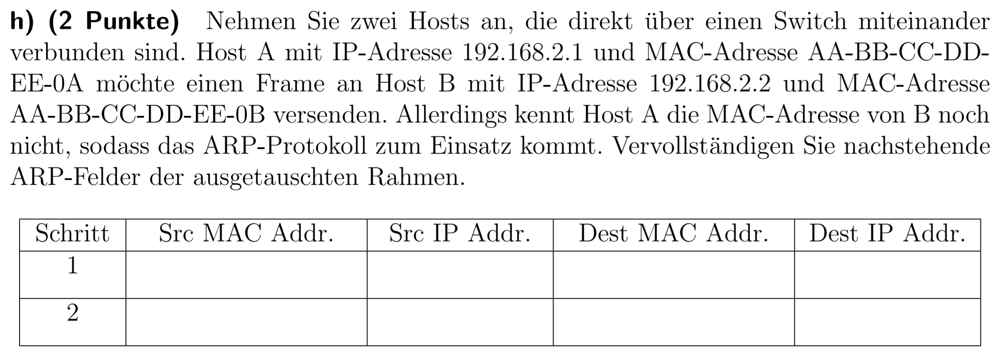

# Rechnerkommunikation: Klausurfragen in der Übersicht
## Wissensfragen
### SS19
- 

  
Paketvermittlung vs. Leitungsvermittung

  
  **Frage:**
  (2 Punkte) Was ist ein Vorteil der Paketvermittlung gegenüber der Leitungsvermittlung? Begründen Sie diesen kurz.

  **Referenz:**
  _Einführung - Folie 17_
  

- 

  
Gründe für Paketverlust

  
  **Frage:**
  (2 Punkte) Nennen Sie zwei Ursachen für Verluste in paketvermittelten Netzen.

  **Referenz:**
  _Transportschicht - Folie 15_
  

- 

  
Iterative vs. Rekursive DNS Anfrage

  
  **Frage:**
  (2 Punkte) Was ist der Unterschied zwischen einer iterativen und einer rekursiven DNS-Anfrage?

  **Referenz:**
  _Anwendungschicht - Folie 67/68_
  

- 

  
UDP vs. TCP

  
  **Frage:**
  (2 Punkte) Nennen Sie je einen Vor- und einen Nachteil von UDP gegenüber TCP.

  **Referenz:**
  <https://www.netburner.com/learn/tcp-vs-udp-battle-of-the-protocols/>
  

- 

  
Überlastkontrolle (Congestion Windows)

  
  **Frage:**
  (3 Punkte) In nachstehender Tabelle soll der Verlauf des Congestion Windows (Fenster der Überlastkontrolle) bei TCP veranschaulicht werden.
  

  **Referenz:**
  _Transportschicht - Folie 49_
  

- 

  
Exterior Gateway Protokolle (Vertreter)

  
  **Frage:**
  (1 Punkt) Zum Routing über mehrere Routingdomänen hinweg kommen Exterior Gateway Protokolle zum Einsatz. Nennen Sie den wichtigsten Vertreter.

  **Referenz:**
  _Netzwerkschicht - Folie 114_
  

- 

  
Exterior Gateway Protokolle vs. Interior Gateway Protokolle 

  
  **Frage:**
  (2 Punkte) Erläutern Sie einen möglichen Grund, warum fürs Routing über Routingsdomänen hinweg nicht einfach auf Interior Gateway Protokolle gesetzt wird, also z.B. Distanzvektorrouting.

  **Referenz:**

- 

  
ARP (Felder/Schritte) 

  
  **Frage:**
  (2 Punkte) Nehmen Sie zwei Hosts an, die direkt über einen Switch miteinander verbunden sind. Host A mit IP-Adresse 192.168.2.1 und MAC-Adresse AA-BB-CC-DDEE-0A möchte einen Frame an Host B mit IP-Adresse 192.168.2.2 und MAC-Adresse AA-BB-CC-DD-EE-0B versenden. Allerdings kennt Host A die MAC-Adresse von B noch nicht, sodass das ARP-Protokoll zum Einsatz kommt. Vervollständigen Sie nachstehende ARP-Felder der ausgetauschten Rahmen.
  

  **Referenz:**
  _Sicherungsschicht - Folie 9/10_
  

- 

  
Grund für Kollisionen bei CSMA

  
  **Frage:**
  (3 Punkte) Was ist die Grundidee von CSMA-Verfahren? Warum können dennoch noch Kollisionen auftreten?

  **Referenz:**
  _Sicherungsschicht - Folie 41/42_
  
  
  _Sicherungsschicht - Folie 43_ -> Kollisionsgrund
  

- 

  
CSMA/CD - Kollision sicher erkennen

  
  **Frage:**
  (3 Punkte) Nehmen Sie an, Sie verwenden CSMA/CD fur den Medienzugriff. Ein Rahmen sei 1250 Bytes groß, die maximale Ausbreitungsverzögerung betrage 2ms, Sie senden mit 1 Mbit/s. Berechnen Sie, ob Kollisionen sicher erkannt werden. Erläutern Sie den Ansatz in eigenen Worten.

  **Referenz:**
  _Sicherungsschicht - Folie 48/50_
  

- 

  
Hidden-Terminal-Problem

  
  **Frage:**
  (3 Punkte) Erläutern Sie kurz das Hidden-Terminal-Problem.

  **Referenz:**
  _Sicherungsschicht - Folie 82_
  

### SS15
- Reduzierung des Datenverkehrs durch Caching
- P2P vs. Client-Server
- Manchster-Kodierung vs. NRZ
- DNS (Kommunikation ohne DNS möglich)
- Medienzugriffsverfahren wählen (Rechnung + Bedingungen)
- SNMP
- Datenrate eines Modems (Frequenz + SNR + Leitung)
- Rechenaufgaben zu Mehrbenutzer Kanäle und Schiebefensterverfahren

### SS14
- Verzögerungszeiten in paketvermittelten Netzen
- Gründe für Paketverlust
- Grund für minimale Fenstergröße (64 Byte [14 Byte Header, 46 Byte Nutzdaten, 4 Byte CRC])
- Stop-And-Wait ACK Zwischenspeicherung
- IPv6 vs. IPv4 (schnellere Paketverarbeitung)
- CSMA/CA vs. CSMA/CD (für W-Lan)
- statische Kanalaufteilung vs. zufallsbasierten Zugriffsverfahren
- ICMP (Zuverlässlichkeit)
- TCP/IP (Header zur Weiterleitung)(NAT-Router)

### WS13/14

