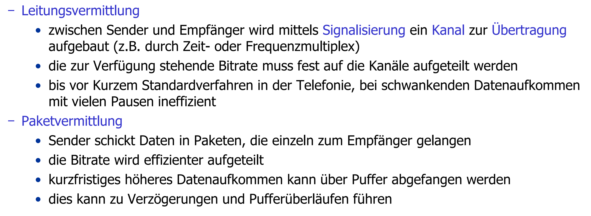

# Rechnerkommunikation: Klausurfragen in der Übersicht
## Wissensfragen
### SS19
- 

  
Paketvermittlung vs. Leitungsvermittung

  
  _Einführung - Folie 17_
  

- 

  
Gründe für Paketverlust

  
  _Transportschicht - Folie 15_
  

- 

  
Iterative vs. Rekursive DNS Anfrage

  
  _Anwendungschicht - Folie 67/68_
  

- 

  
UDP vs. TCP

  
  <https://www.netburner.com/learn/tcp-vs-udp-battle-of-the-protocols/>
  

- 

  
Überlastkontrolle (Congestion Windows)

  
  _Transportschicht - Folie 49_
  

- 

  
Exterior Gateway Protokolle (Vertreter)

  
  _Netzwerkschicht - Folie 114_
  

- Exterior Gateway Protokolle vs. Interior Gateway Protokolle

- 

  
ARP (Felder/Schritte) 

  
  _Sicherungsschicht - Folie 9/10_
  

- 

  
Grund für Kollisionen bei CSMA 

  
  _Sicherungsschicht - Folie 41/42_
  
  
  _Sicherungsschicht - Folie 43_ -> Kollisionsgrund
  

- 

  
CSMA/CD - Kollision sicher erkennen 

  
  _Sicherungsschicht - Folie 48/50_
  

- 

  
Hidden-Terminal-Problem 

  
  _Sicherungsschicht - Folie 82_
  

### SS15
- Reduzierung des Datenverkehrs durch Caching
- P2P vs. Client-Server
- Manchster-Kodierung vs. NRZ
- DNS (Kommunikation ohne DNS möglich)
- Medienzugriffsverfahren wählen (Rechnung + Bedingungen)
- SNMP
- Datenrate eines Modems (Frequenz + SNR + Leitung)
- Rechenaufgaben zu Mehrbenutzer Kanäle und Schiebefensterverfahren

### SS14
- Verzögerungszeiten in paketvermittelten Netzen
- Gründe für Paketverlust
- Grund für minimale Fenstergröße (64 Byte [14 Byte Header, 46 Byte Nutzdaten, 4 Byte CRC])
- Stop-And-Wait ACK Zwischenspeicherung
- IPv6 vs. IPv4 (schnellere Paketverarbeitung)
- CSMA/CA vs. CSMA/CD (für W-Lan)
- statische Kanalaufteilung vs. zufallsbasierten Zugriffsverfahren
- ICMP (Zuverlässlichkeit)
- TCP/IP (Header zur Weiterleitung)(NAT-Router)

### WS13/14

